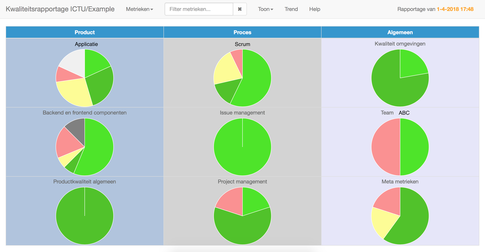
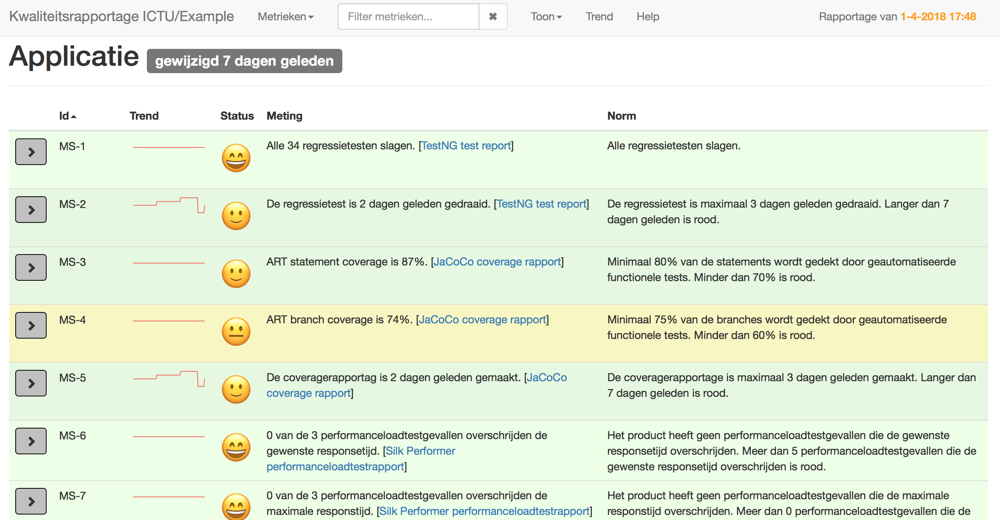
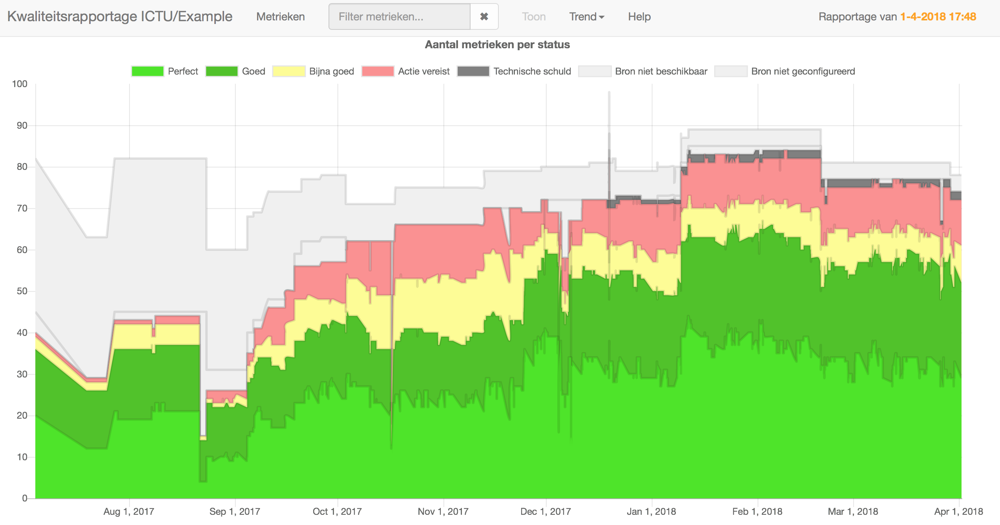

HQ - Holistic Software Quality Reporting
========================================

Application to generate quality reports for software development projects.
Holistic because HQ attempts to measure as many aspects of software development as
possible, seeing how software development can go off the rails in so many ways.

HQ itself is developed in Python (backend) and JavaScript (frontend), but can report on the quality of software 
developed in any language as it doesn't measure the quality itself, but instead
relies on other tools to feed it information. Metric sources include SonarQube, Jenkins,
Jira, Jacoco, JMeter, OWASP dependency checker, and more.

The user interface is currently available in Dutch only.

An example report is available via http://ictu.github.io/quality-report/.

This software was developed by ICTU (http://www.ictu.nl) to support the 
development of the Landelijk Register Kinderopvang for the Ministerie van
Sociale Zaken en Werkgelegenheid.

See docs/AUTHORS.txt for contact information.
See docs/LICENSE.txt for license information.
See docs/HOWTO.txt for information on how to configure quality reports.

Screenshots
-----------

### Dashboard

Each report has a dashboard that provides an overview of the project.

### Metrics

Clicking a component (pie chart) in the dashboard navigates to the metrics of the clicked component.

### Trend

Recent changes in individual metrics are displayed using spark line graphs. 
Long term changes are visible in the trend graphs.

Usage
-----

### Using Python 3.6

Install HQ from the Python Package Index (PyPI):

    pip install quality_report

We recommend using virtualenv:

    $HQ_VIRTUAL_ENV=/home/jenkins/hq-pyenv  # For example

    # Delete previous version
    if [ -d $HQ_VIRTUAL_ENV ]; then
        rm -rf $HQ_VIRTUAL_ENV
    fi
    
    # Create the virtualenv and activate it
    virtualenv $HQ_VIRTUAL_ENV
    . $HQ_VIRTUAL_ENV/bin/activate
    
    # Install HQ
    pip install quality_report
    
HQ can now be started from the command line:

    $PROJECT=/path/to/project_definition_folder
    $REPORT=/path/to/folder/to/write/report/to
    quality_report.py --project $PROJECT --report $REPORT

### Using Docker

Pull the image from Docker Hub:

    docker pull ictu/quality-report

HQ can now be started from the command line:

    $PROJECT=/path/to/project_definition_folder
    $REPORT=/path/to/folder/to/write/report/to
    docker run --rm -u `id -u`:`id -g` -v /etc/localtime:/etc/localtime:ro -v `pwd`:/work -w /work ictu/quality-report --project $PROJECT --report $REPORT
